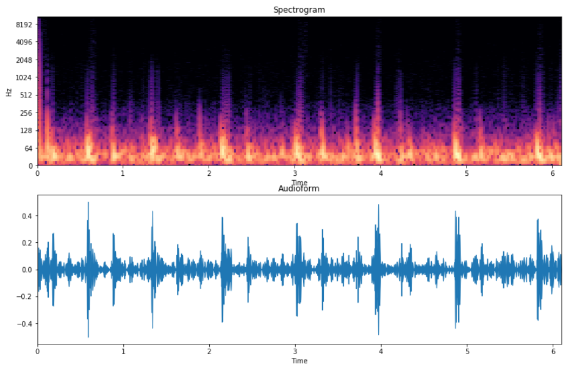

# 🫁 lung-sound-classifier

Upload a lung sound MP3. It splits the audio into segments, converts them into spectrogram images, and uses EfficientNet-B0 to classify 9 lung conditions. Final prediction is averaged across all segments.

---

## Spectrogram Preview



---

## Repository Structure

```
lung-sound-classifier/
│
├── Audio Predict/
│   ├── spectrograms/
│   │   ├── Test_audio_seg001.png
│   │   ├── Test_audio_seg002.png
│   │   └── Test_audio_seg003.png
│   ├── audio_predict.py
│   ├── best_efficientnet.pth
│   └── Test_audio.mp3
│
└── Train Model/
    ├── TrainModel.ipynb
    ├── best_efficientnet.pth
    └── Dataset/
        ├── Atelectasis/
        ├── Consolidation Lung/
        ├── COVID-19/
        ├── Edema/
        ├── Lungs Cancer/
        ├── Normal/
        ├── Pneumonia/
        ├── Pneumothorax/
        └── Tuberculosis/
```

---

## Pipeline : Audio Predict

| Step | Description |
|------|-------------|
| 1 | Load MP3 → resample to 22 050 Hz → WAV |
| 2 | Pre-emphasis (α = 0.97) + normalization |
| 3 | Segment audio into 20-second clips |
| 4 | Compute STFT (n_fft = 512, Hamming window) |
| 5 | Generate 128-band Mel spectrogram → PNG |
| 6 | Run EfficientNet-B0 on each spectrogram |
| 7 | Average probabilities → single final prediction |

---

## Model : EfficientNet-B0

- **Backbone:** EfficientNet-B0 pretrained on ImageNet
- **Fine-tuning:** Layers unfrozen from `features.4` onward
- **Classifier head:** `Dropout(0.4)` → `Linear(1280 → 9)`
- **Loss:** CrossEntropyLoss with label smoothing (0.1)
- **Optimizer:** AdamW — lr = 1e-4, weight_decay = 1e-4
- **Scheduler:** CosineAnnealingLR over 70 epochs
- **Training split:** 75% train / 15% val / 10% test

---

## Classes (9 conditions)

| | | |
|---|---|---|
| Atelectasis | Consolidation Lung | COVID-19 |
| Edema | Lungs Cancer | Normal |
| Pneumonia | Pneumothorax | Tuberculosis |

---

## Quick Start

### 1. Install dependencies

```bash
pip install torch torchvision librosa soundfile scipy matplotlib pillow
```

### 2. Run prediction

```bash
cd "Audio Predict"
python audio_predict.py Test_audio.mp3
```

### 3. Train the model

Open `Train Model/TrainModel.ipynb` and run all cells.  
Make sure your `Dataset/` folder has one subfolder per class with spectrogram images.

---

## Output Example

```
══════════════════════════════════════════════════
📋  FINAL PREDICTION  (averaged over all segments)
══════════════════════════════════════════════════

🏆  Pneumonia  (74.3%)

📊  Top 3:
  Pneumonia                  74.3%  ██████████████████████
  Tuberculosis               13.1%  ███
  Normal                      7.5%  ██
```

---

## Requirements

- Python 3.8+
- PyTorch 2.x (CUDA optional but recommended)
- librosa, soundfile, scipy, matplotlib, Pillow
- torchvision

---
